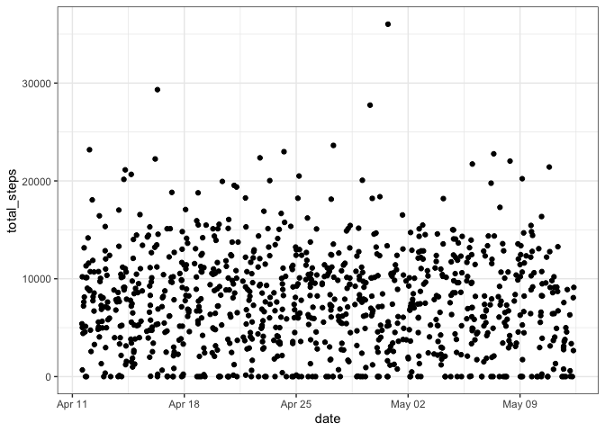
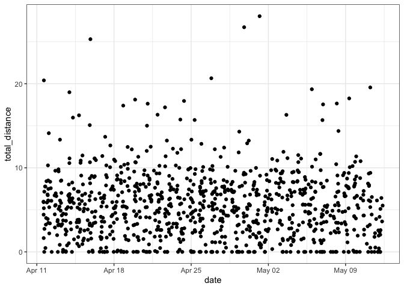
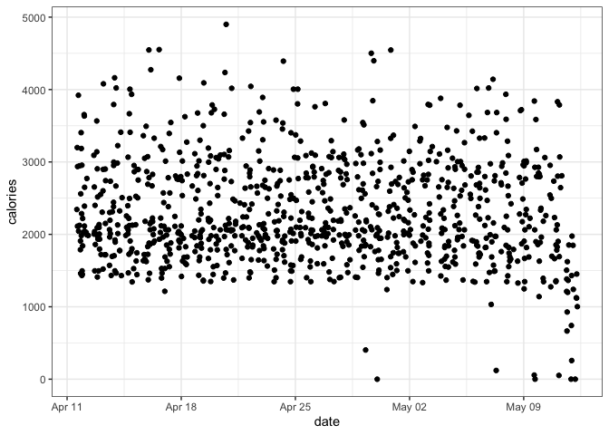
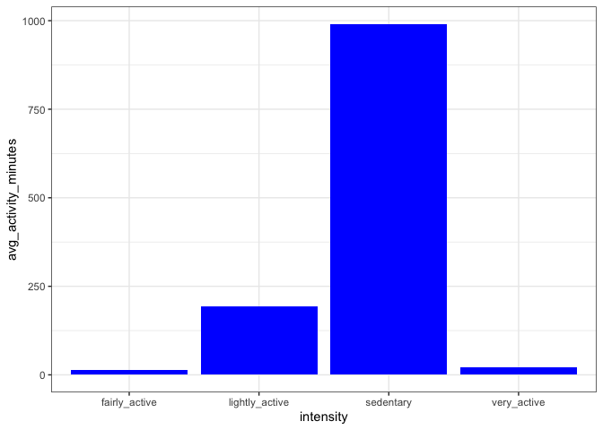
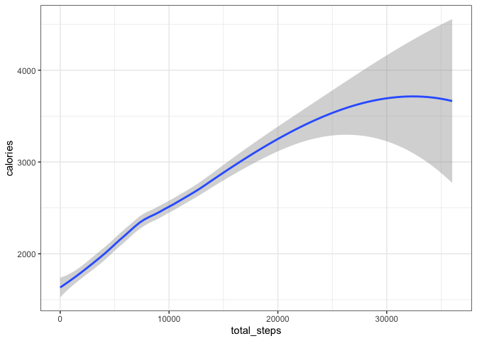
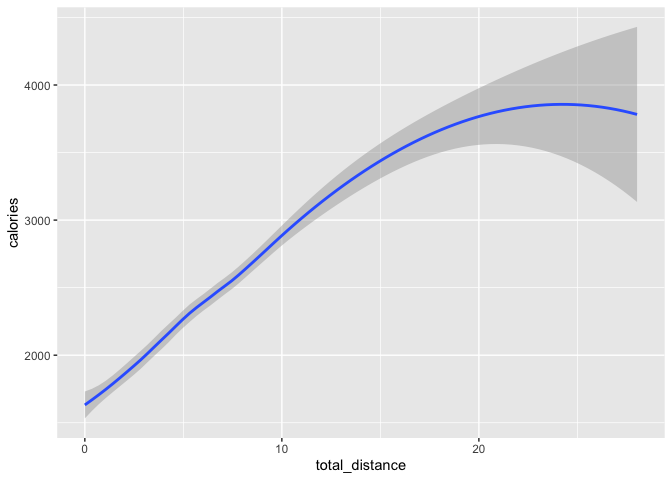
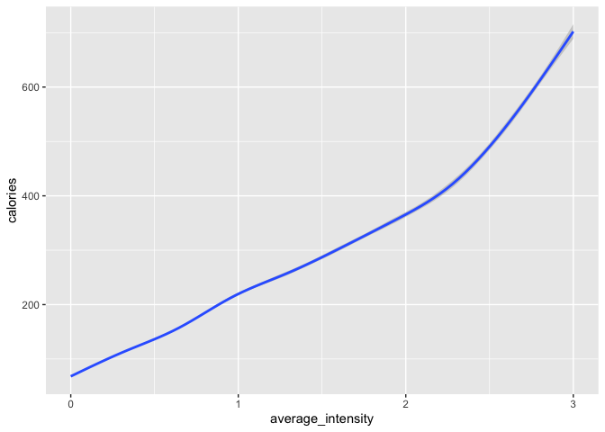
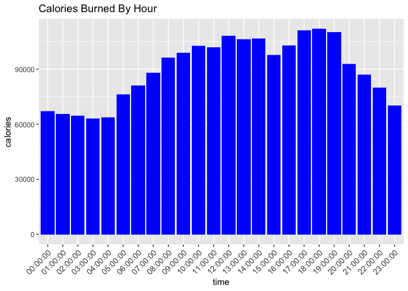
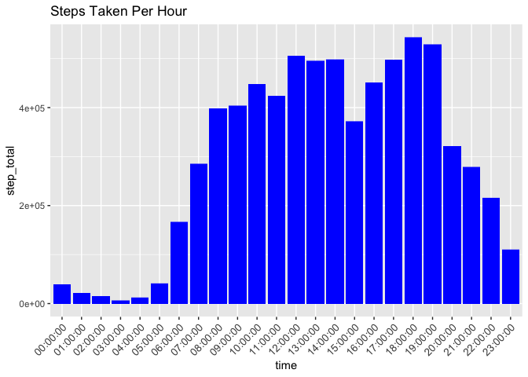
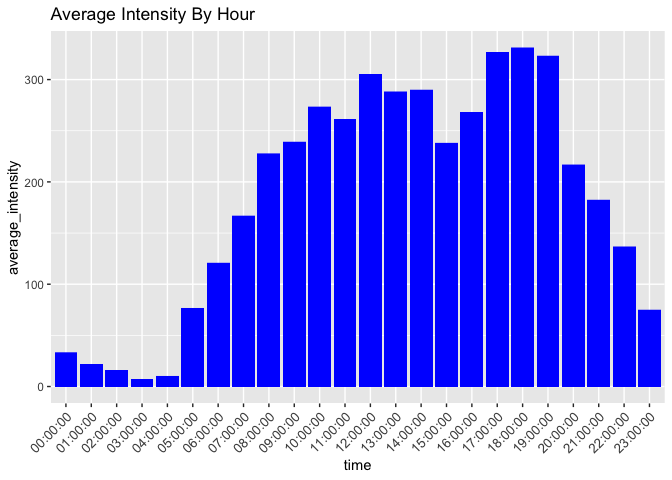

Beall Beat Activity Analysis
================

# Introduction

Bellabeat, a high-tech manufacturer of health-focused products for
women. Bellabeat is a successful small company, but they have the
potential to become a larger player in the global smart device market.

Urška Sršen, cofounder and Chief Creative Officer of Bellabeat, believes
that analyzing smart device fitness data could help unlock new growth
opportunities for the company.

# Ask

**1. Sršen asks you to analyze smart device usage data in order to gain
insight into how consumers use non-Bellabeat smart devices.**

-   What are some trends in non-Bellabeat smart device usage?

**2. She then wants you to select one Bellabeat product to apply these
insights to in your presentation.**

-   How could these trends apply to Bellabeat customers?
-   How could these trends help influence Bellabeat marketing strategy?

### Products

-   **Bellabeat app:** The Bellabeat app provides users with health data
    related to their activity, sleep, stress, menstrual cycle, and
    mindfulness habits. This data can help users better understand their
    current habits and make healthy decisions. The Bellabeat app
    connects to their line of smart wellness products.

-   **Leaf:** Bellabeat’s classic wellness tracker can be worn as a
    bracelet, necklace, or clip. The Leaf tracker connects to the
    Bellabeat app to track activity, sleep, and stress.

-   **Time:** This wellness watch combines the timeless look of a
    classic timepiece with smart technology to track user activity,
    sleep, and stress. The Time watch connects to the Bellabeat app to
    provide you with insights into your daily wellness.

-   **Spring:** This is a water bottle that tracks daily water intake
    using smart technology to ensure that you are appropriately hydrated
    throughout the day. The Spring bottle connects to the Bellabeat app
    to track your hydration levels.

-   **Bellabeat membership:** Bellabeat also offers a subscription-based
    membership program for users. Membership gives users 24/7 access to
    fully personalized guidance on nutrition, activity, sleep, health
    and beauty, and mindfulness based on their lifestyle and goals.

## Prepare

Sršen encourages you to use public data that explores smart device
users’ daily habits. She points you to a specific data set:  
[FitBit Fitness Tracker Data](https://www.kaggle.com/arashnic/fitbit)

All data will be downloaded loacally

Reliable  
Original  
Comprehensive  
Current  
Cited

## Process

I am going to use Rstudio to analyze the data set.

``` r
library(plyr)
library(tidyverse)
```

    ## ── Attaching packages ─────────────────────────────────────── tidyverse 1.3.1 ──

    ## ✓ ggplot2 3.3.4     ✓ purrr   0.3.4
    ## ✓ tibble  3.1.2     ✓ dplyr   1.0.7
    ## ✓ tidyr   1.1.3     ✓ stringr 1.4.0
    ## ✓ readr   1.4.0     ✓ forcats 0.5.1

    ## ── Conflicts ────────────────────────────────────────── tidyverse_conflicts() ──
    ## x dplyr::arrange()   masks plyr::arrange()
    ## x purrr::compact()   masks plyr::compact()
    ## x dplyr::count()     masks plyr::count()
    ## x dplyr::failwith()  masks plyr::failwith()
    ## x dplyr::filter()    masks stats::filter()
    ## x dplyr::id()        masks plyr::id()
    ## x dplyr::lag()       masks stats::lag()
    ## x dplyr::mutate()    masks plyr::mutate()
    ## x dplyr::rename()    masks plyr::rename()
    ## x dplyr::summarise() masks plyr::summarise()
    ## x dplyr::summarize() masks plyr::summarize()

``` r
library(janitor)
```

    ## 
    ## Attaching package: 'janitor'

    ## The following objects are masked from 'package:stats':
    ## 
    ##     chisq.test, fisher.test

``` r
library(lubridate)
```

    ## 
    ## Attaching package: 'lubridate'

    ## The following objects are masked from 'package:base':
    ## 
    ##     date, intersect, setdiff, union

``` r
library(ggpubr)
```

    ## 
    ## Attaching package: 'ggpubr'

    ## The following object is masked from 'package:plyr':
    ## 
    ##     mutate

``` r
library(knitr)
```

``` r
#read csv files,clean column names
daily_activity <- read_csv("~/Desktop/R-Data/dailyActivity_merged.csv")%>% 
  clean_names()
```

    ## 
    ## ── Column specification ────────────────────────────────────────────────────────
    ## cols(
    ##   Id = col_double(),
    ##   ActivityDate = col_character(),
    ##   TotalSteps = col_double(),
    ##   TotalDistance = col_double(),
    ##   TrackerDistance = col_double(),
    ##   LoggedActivitiesDistance = col_double(),
    ##   VeryActiveDistance = col_double(),
    ##   ModeratelyActiveDistance = col_double(),
    ##   LightActiveDistance = col_double(),
    ##   SedentaryActiveDistance = col_double(),
    ##   VeryActiveMinutes = col_double(),
    ##   FairlyActiveMinutes = col_double(),
    ##   LightlyActiveMinutes = col_double(),
    ##   SedentaryMinutes = col_double(),
    ##   Calories = col_double()
    ## )

``` r
sleep <- read_csv("~/Desktop/R-Data/sleepDay_merged.csv") %>% 
  clean_names()
```

    ## 
    ## ── Column specification ────────────────────────────────────────────────────────
    ## cols(
    ##   Id = col_double(),
    ##   SleepDay = col_character(),
    ##   TotalSleepRecords = col_double(),
    ##   TotalMinutesAsleep = col_double(),
    ##   TotalTimeInBed = col_double()
    ## )

``` r
weight_log <- read_csv("~/Desktop/R-Data/weightLogInfo_merged.csv") %>% 
  clean_names()
```

    ## 
    ## ── Column specification ────────────────────────────────────────────────────────
    ## cols(
    ##   Id = col_double(),
    ##   Date = col_character(),
    ##   WeightKg = col_double(),
    ##   WeightPounds = col_double(),
    ##   Fat = col_double(),
    ##   BMI = col_double(),
    ##   IsManualReport = col_logical(),
    ##   LogId = col_double()
    ## )

``` r
hourly_calories <- read_csv("~/Desktop/R-Data/hourlyCalories_merged.csv") %>%
  clean_names()
```

    ## 
    ## ── Column specification ────────────────────────────────────────────────────────
    ## cols(
    ##   Id = col_double(),
    ##   ActivityHour = col_character(),
    ##   Calories = col_double()
    ## )

``` r
hourly_intensities <- read_csv("~/Desktop/R-Data/hourlyIntensities_merged.csv") %>% 
  clean_names()
```

    ## 
    ## ── Column specification ────────────────────────────────────────────────────────
    ## cols(
    ##   Id = col_double(),
    ##   ActivityHour = col_character(),
    ##   TotalIntensity = col_double(),
    ##   AverageIntensity = col_double()
    ## )

``` r
hourly_steps <- read_csv("~/Desktop/R-Data/hourlySteps_merged.csv") %>% 
  clean_names()
```

    ## 
    ## ── Column specification ────────────────────────────────────────────────────────
    ## cols(
    ##   Id = col_double(),
    ##   ActivityHour = col_character(),
    ##   StepTotal = col_double()
    ## )

``` r
#view meta data on tables 
str(daily_activity)
```

    ## spec_tbl_df [940 × 15] (S3: spec_tbl_df/tbl_df/tbl/data.frame)
    ##  $ id                        : num [1:940] 1.5e+09 1.5e+09 1.5e+09 1.5e+09 1.5e+09 ...
    ##  $ activity_date             : chr [1:940] "4/12/2016" "4/13/2016" "4/14/2016" "4/15/2016" ...
    ##  $ total_steps               : num [1:940] 13162 10735 10460 9762 12669 ...
    ##  $ total_distance            : num [1:940] 8.5 6.97 6.74 6.28 8.16 ...
    ##  $ tracker_distance          : num [1:940] 8.5 6.97 6.74 6.28 8.16 ...
    ##  $ logged_activities_distance: num [1:940] 0 0 0 0 0 0 0 0 0 0 ...
    ##  $ very_active_distance      : num [1:940] 1.88 1.57 2.44 2.14 2.71 ...
    ##  $ moderately_active_distance: num [1:940] 0.55 0.69 0.4 1.26 0.41 ...
    ##  $ light_active_distance     : num [1:940] 6.06 4.71 3.91 2.83 5.04 ...
    ##  $ sedentary_active_distance : num [1:940] 0 0 0 0 0 0 0 0 0 0 ...
    ##  $ very_active_minutes       : num [1:940] 25 21 30 29 36 38 42 50 28 19 ...
    ##  $ fairly_active_minutes     : num [1:940] 13 19 11 34 10 20 16 31 12 8 ...
    ##  $ lightly_active_minutes    : num [1:940] 328 217 181 209 221 164 233 264 205 211 ...
    ##  $ sedentary_minutes         : num [1:940] 728 776 1218 726 773 ...
    ##  $ calories                  : num [1:940] 1985 1797 1776 1745 1863 ...
    ##  - attr(*, "spec")=
    ##   .. cols(
    ##   ..   Id = col_double(),
    ##   ..   ActivityDate = col_character(),
    ##   ..   TotalSteps = col_double(),
    ##   ..   TotalDistance = col_double(),
    ##   ..   TrackerDistance = col_double(),
    ##   ..   LoggedActivitiesDistance = col_double(),
    ##   ..   VeryActiveDistance = col_double(),
    ##   ..   ModeratelyActiveDistance = col_double(),
    ##   ..   LightActiveDistance = col_double(),
    ##   ..   SedentaryActiveDistance = col_double(),
    ##   ..   VeryActiveMinutes = col_double(),
    ##   ..   FairlyActiveMinutes = col_double(),
    ##   ..   LightlyActiveMinutes = col_double(),
    ##   ..   SedentaryMinutes = col_double(),
    ##   ..   Calories = col_double()
    ##   .. )

``` r
str(sleep)
```

    ## spec_tbl_df [413 × 5] (S3: spec_tbl_df/tbl_df/tbl/data.frame)
    ##  $ id                  : num [1:413] 1.5e+09 1.5e+09 1.5e+09 1.5e+09 1.5e+09 ...
    ##  $ sleep_day           : chr [1:413] "4/12/2016 12:00:00 AM" "4/13/2016 12:00:00 AM" "4/15/2016 12:00:00 AM" "4/16/2016 12:00:00 AM" ...
    ##  $ total_sleep_records : num [1:413] 1 2 1 2 1 1 1 1 1 1 ...
    ##  $ total_minutes_asleep: num [1:413] 327 384 412 340 700 304 360 325 361 430 ...
    ##  $ total_time_in_bed   : num [1:413] 346 407 442 367 712 320 377 364 384 449 ...
    ##  - attr(*, "spec")=
    ##   .. cols(
    ##   ..   Id = col_double(),
    ##   ..   SleepDay = col_character(),
    ##   ..   TotalSleepRecords = col_double(),
    ##   ..   TotalMinutesAsleep = col_double(),
    ##   ..   TotalTimeInBed = col_double()
    ##   .. )

``` r
str(weight_log)
```

    ## spec_tbl_df [67 × 8] (S3: spec_tbl_df/tbl_df/tbl/data.frame)
    ##  $ id              : num [1:67] 1.50e+09 1.50e+09 1.93e+09 2.87e+09 2.87e+09 ...
    ##  $ date            : chr [1:67] "5/2/2016 11:59:59 PM" "5/3/2016 11:59:59 PM" "4/13/2016 1:08:52 AM" "4/21/2016 11:59:59 PM" ...
    ##  $ weight_kg       : num [1:67] 52.6 52.6 133.5 56.7 57.3 ...
    ##  $ weight_pounds   : num [1:67] 116 116 294 125 126 ...
    ##  $ fat             : num [1:67] 22 NA NA NA NA 25 NA NA NA NA ...
    ##  $ bmi             : num [1:67] 22.6 22.6 47.5 21.5 21.7 ...
    ##  $ is_manual_report: logi [1:67] TRUE TRUE FALSE TRUE TRUE TRUE ...
    ##  $ log_id          : num [1:67] 1.46e+12 1.46e+12 1.46e+12 1.46e+12 1.46e+12 ...
    ##  - attr(*, "spec")=
    ##   .. cols(
    ##   ..   Id = col_double(),
    ##   ..   Date = col_character(),
    ##   ..   WeightKg = col_double(),
    ##   ..   WeightPounds = col_double(),
    ##   ..   Fat = col_double(),
    ##   ..   BMI = col_double(),
    ##   ..   IsManualReport = col_logical(),
    ##   ..   LogId = col_double()
    ##   .. )

``` r
str(hourly_calories)
```

    ## spec_tbl_df [22,099 × 3] (S3: spec_tbl_df/tbl_df/tbl/data.frame)
    ##  $ id           : num [1:22099] 1.5e+09 1.5e+09 1.5e+09 1.5e+09 1.5e+09 ...
    ##  $ activity_hour: chr [1:22099] "4/12/2016 12:00:00 AM" "4/12/2016 1:00:00 AM" "4/12/2016 2:00:00 AM" "4/12/2016 3:00:00 AM" ...
    ##  $ calories     : num [1:22099] 81 61 59 47 48 48 48 47 68 141 ...
    ##  - attr(*, "spec")=
    ##   .. cols(
    ##   ..   Id = col_double(),
    ##   ..   ActivityHour = col_character(),
    ##   ..   Calories = col_double()
    ##   .. )

``` r
str(hourly_intensities)
```

    ## spec_tbl_df [22,099 × 4] (S3: spec_tbl_df/tbl_df/tbl/data.frame)
    ##  $ id               : num [1:22099] 1.5e+09 1.5e+09 1.5e+09 1.5e+09 1.5e+09 ...
    ##  $ activity_hour    : chr [1:22099] "4/12/2016 12:00:00 AM" "4/12/2016 1:00:00 AM" "4/12/2016 2:00:00 AM" "4/12/2016 3:00:00 AM" ...
    ##  $ total_intensity  : num [1:22099] 20 8 7 0 0 0 0 0 13 30 ...
    ##  $ average_intensity: num [1:22099] 0.333 0.133 0.117 0 0 ...
    ##  - attr(*, "spec")=
    ##   .. cols(
    ##   ..   Id = col_double(),
    ##   ..   ActivityHour = col_character(),
    ##   ..   TotalIntensity = col_double(),
    ##   ..   AverageIntensity = col_double()
    ##   .. )

``` r
str(hourly_steps)
```

    ## spec_tbl_df [22,099 × 3] (S3: spec_tbl_df/tbl_df/tbl/data.frame)
    ##  $ id           : num [1:22099] 1.5e+09 1.5e+09 1.5e+09 1.5e+09 1.5e+09 ...
    ##  $ activity_hour: chr [1:22099] "4/12/2016 12:00:00 AM" "4/12/2016 1:00:00 AM" "4/12/2016 2:00:00 AM" "4/12/2016 3:00:00 AM" ...
    ##  $ step_total   : num [1:22099] 373 160 151 0 0 ...
    ##  - attr(*, "spec")=
    ##   .. cols(
    ##   ..   Id = col_double(),
    ##   ..   ActivityHour = col_character(),
    ##   ..   StepTotal = col_double()
    ##   .. )

## After looking at the meta data, I see some format changes that need to be made and that some of these tables can be joined into two master tables: daily\_activity & hourly\_activity

### daily\_activty

``` r
#transform daily_activity

daily_activity <- daily_activity %>% 
  mutate(activity_date = mdy(activity_date), day_week = weekdays(activity_date)) %>% 
  rename(date = activity_date) %>% 
  select(-logged_activities_distance,-very_active_distance,-moderately_active_distance,
         -light_active_distance, -sedentary_active_distance)

sleep <- sleep %>%
  mutate(sleep_day = mdy_hms(sleep_day)) %>% 
  rename(date = sleep_day )

weight_log <- weight_log %>% 
  mutate(date = mdy_hms(date)) %>% 
  separate(date, into=c("date", "time"), sep = " ") %>% 
  select(-time,-weight_kg, -is_manual_report,-log_id)
```

### hourly\_activity

``` r
hourly_calories <- hourly_calories %>% 
  mutate(date = mdy_hms(activity_hour)) %>% 
  separate(date, into = c("date", "time"), sep = " ") %>% 
  select(-activity_hour)
 
hourly_intensities <- hourly_intensities %>% 
  mutate(date = mdy_hms(activity_hour)) %>% 
  separate(date, into=c("date","time"), sep = " ") %>% 
  select(-activity_hour)

hourly_steps <- hourly_steps %>% 
  mutate(date = mdy_hms(activity_hour)) %>% 
  separate(date, into=c("date","time"), sep = " ") %>% 
  select(-activity_hour)
```

### Now that we have transformed the data into a better format I would like to scan the meta again to make sure the dates were parsed and the columns are correct

``` r
glimpse(daily_activity)
```

    ## Rows: 940
    ## Columns: 11
    ## $ id                     <dbl> 1503960366, 1503960366, 1503960366, 1503960366,…
    ## $ date                   <date> 2016-04-12, 2016-04-13, 2016-04-14, 2016-04-15…
    ## $ total_steps            <dbl> 13162, 10735, 10460, 9762, 12669, 9705, 13019, …
    ## $ total_distance         <dbl> 8.50, 6.97, 6.74, 6.28, 8.16, 6.48, 8.59, 9.88,…
    ## $ tracker_distance       <dbl> 8.50, 6.97, 6.74, 6.28, 8.16, 6.48, 8.59, 9.88,…
    ## $ very_active_minutes    <dbl> 25, 21, 30, 29, 36, 38, 42, 50, 28, 19, 66, 41,…
    ## $ fairly_active_minutes  <dbl> 13, 19, 11, 34, 10, 20, 16, 31, 12, 8, 27, 21, …
    ## $ lightly_active_minutes <dbl> 328, 217, 181, 209, 221, 164, 233, 264, 205, 21…
    ## $ sedentary_minutes      <dbl> 728, 776, 1218, 726, 773, 539, 1149, 775, 818, …
    ## $ calories               <dbl> 1985, 1797, 1776, 1745, 1863, 1728, 1921, 2035,…
    ## $ day_week               <chr> "Tuesday", "Wednesday", "Thursday", "Friday", "…

``` r
glimpse(sleep)
```

    ## Rows: 413
    ## Columns: 5
    ## $ id                   <dbl> 1503960366, 1503960366, 1503960366, 1503960366, 1…
    ## $ date                 <dttm> 2016-04-12, 2016-04-13, 2016-04-15, 2016-04-16, …
    ## $ total_sleep_records  <dbl> 1, 2, 1, 2, 1, 1, 1, 1, 1, 1, 1, 1, 1, 1, 1, 1, 1…
    ## $ total_minutes_asleep <dbl> 327, 384, 412, 340, 700, 304, 360, 325, 361, 430,…
    ## $ total_time_in_bed    <dbl> 346, 407, 442, 367, 712, 320, 377, 364, 384, 449,…

``` r
glimpse(weight_log)
```

    ## Rows: 67
    ## Columns: 5
    ## $ id            <dbl> 1503960366, 1503960366, 1927972279, 2873212765, 28732127…
    ## $ date          <chr> "2016-05-02", "2016-05-03", "2016-04-13", "2016-04-21", …
    ## $ weight_pounds <dbl> 115.9631, 115.9631, 294.3171, 125.0021, 126.3249, 159.61…
    ## $ fat           <dbl> 22, NA, NA, NA, NA, 25, NA, NA, NA, NA, NA, NA, NA, NA, …
    ## $ bmi           <dbl> 22.65, 22.65, 47.54, 21.45, 21.69, 27.45, 27.38, 27.25, …

``` r
glimpse(hourly_calories)
```

    ## Rows: 22,099
    ## Columns: 4
    ## $ id       <dbl> 1503960366, 1503960366, 1503960366, 1503960366, 1503960366, 1…
    ## $ calories <dbl> 81, 61, 59, 47, 48, 48, 48, 47, 68, 141, 99, 76, 73, 66, 110,…
    ## $ date     <chr> "2016-04-12", "2016-04-12", "2016-04-12", "2016-04-12", "2016…
    ## $ time     <chr> "00:00:00", "01:00:00", "02:00:00", "03:00:00", "04:00:00", "…

``` r
glimpse(hourly_intensities)
```

    ## Rows: 22,099
    ## Columns: 5
    ## $ id                <dbl> 1503960366, 1503960366, 1503960366, 1503960366, 1503…
    ## $ total_intensity   <dbl> 20, 8, 7, 0, 0, 0, 0, 0, 13, 30, 29, 12, 11, 6, 36, …
    ## $ average_intensity <dbl> 0.333333, 0.133333, 0.116667, 0.000000, 0.000000, 0.…
    ## $ date              <chr> "2016-04-12", "2016-04-12", "2016-04-12", "2016-04-1…
    ## $ time              <chr> "00:00:00", "01:00:00", "02:00:00", "03:00:00", "04:…

``` r
glimpse(hourly_steps)
```

    ## Rows: 22,099
    ## Columns: 4
    ## $ id         <dbl> 1503960366, 1503960366, 1503960366, 1503960366, 1503960366,…
    ## $ step_total <dbl> 373, 160, 151, 0, 0, 0, 0, 0, 250, 1864, 676, 360, 253, 221…
    ## $ date       <chr> "2016-04-12", "2016-04-12", "2016-04-12", "2016-04-12", "20…
    ## $ time       <chr> "00:00:00", "01:00:00", "02:00:00", "03:00:00", "04:00:00",…

### Now lets check how many participants made observations.

# Analyze

``` r
## see how many distinct
n_distinct(daily_activity$id)
```

    ## [1] 33

``` r
n_distinct(sleep$id)
```

    ## [1] 24

``` r
n_distinct(weight_log$id)
```

    ## [1] 8

``` r
n_distinct(hourly_calories$id)
```

    ## [1] 33

``` r
n_distinct(hourly_intensities$id)
```

    ## [1] 33

``` r
n_distinct(hourly_steps$id)
```

    ## [1] 33

### Here we can see that weight\_log only has 8 participants and sleep with 24. I will throw these out to just focus on the daily and hourly motion activity.

``` r
## now lets merge these tables into one because I can see that these will merge greatly on "id" & "date"


daily_activity<- full_join(daily_activity,sleep,by = c("id"="id","date" = "date"))

## merge hourly_calories & hourly_steps
hourly_activity <- full_join(hourly_calories,hourly_steps, by = c("id"="id","date"="date","time"="time") )

##merge all three into hourly_activity
hourly_activity <- full_join(hourly_activity,hourly_intensities, by=c("id"="id","date"="date","time"="time"))
```

## Daily & Hourly Activty

``` r
daily_activity %>% 
  summary()
```

    ##        id                 date                      total_steps   
    ##  Min.   :1.504e+09   Min.   :2016-04-12 00:00:00   Min.   :    0  
    ##  1st Qu.:2.320e+09   1st Qu.:2016-04-19 00:00:00   1st Qu.: 3795  
    ##  Median :4.445e+09   Median :2016-04-26 00:00:00   Median : 7439  
    ##  Mean   :4.858e+09   Mean   :2016-04-26 07:21:18   Mean   : 7652  
    ##  3rd Qu.:6.962e+09   3rd Qu.:2016-05-04 00:00:00   3rd Qu.:10734  
    ##  Max.   :8.878e+09   Max.   :2016-05-12 00:00:00   Max.   :36019  
    ##                                                                   
    ##  total_distance   tracker_distance very_active_minutes fairly_active_minutes
    ##  Min.   : 0.000   Min.   : 0.000   Min.   :  0.00      Min.   :  0.00       
    ##  1st Qu.: 2.620   1st Qu.: 2.620   1st Qu.:  0.00      1st Qu.:  0.00       
    ##  Median : 5.260   Median : 5.260   Median :  4.00      Median :  7.00       
    ##  Mean   : 5.503   Mean   : 5.489   Mean   : 21.24      Mean   : 13.63       
    ##  3rd Qu.: 7.720   3rd Qu.: 7.715   3rd Qu.: 32.00      3rd Qu.: 19.00       
    ##  Max.   :28.030   Max.   :28.030   Max.   :210.00      Max.   :143.00       
    ##                                                                             
    ##  lightly_active_minutes sedentary_minutes    calories      day_week        
    ##  Min.   :  0            Min.   :   0.0    Min.   :   0   Length:943        
    ##  1st Qu.:127            1st Qu.: 729.0    1st Qu.:1830   Class :character  
    ##  Median :199            Median :1057.0    Median :2140   Mode  :character  
    ##  Mean   :193            Mean   : 990.4    Mean   :2308                     
    ##  3rd Qu.:264            3rd Qu.:1229.0    3rd Qu.:2796                     
    ##  Max.   :518            Max.   :1440.0    Max.   :4900                     
    ##                                                                            
    ##  total_sleep_records total_minutes_asleep total_time_in_bed
    ##  Min.   :1.000       Min.   : 58.0        Min.   : 61.0    
    ##  1st Qu.:1.000       1st Qu.:361.0        1st Qu.:403.0    
    ##  Median :1.000       Median :433.0        Median :463.0    
    ##  Mean   :1.119       Mean   :419.5        Mean   :458.6    
    ##  3rd Qu.:1.000       3rd Qu.:490.0        3rd Qu.:526.0    
    ##  Max.   :3.000       Max.   :796.0        Max.   :961.0    
    ##  NA's   :530         NA's   :530          NA's   :530

``` r
hourly_activity %>% 
  summary()
```

    ##        id               calories          date               time          
    ##  Min.   :1.504e+09   Min.   : 42.00   Length:22099       Length:22099      
    ##  1st Qu.:2.320e+09   1st Qu.: 63.00   Class :character   Class :character  
    ##  Median :4.445e+09   Median : 83.00   Mode  :character   Mode  :character  
    ##  Mean   :4.848e+09   Mean   : 97.39                                        
    ##  3rd Qu.:6.962e+09   3rd Qu.:108.00                                        
    ##  Max.   :8.878e+09   Max.   :948.00                                        
    ##    step_total      total_intensity  average_intensity
    ##  Min.   :    0.0   Min.   :  0.00   Min.   :0.0000   
    ##  1st Qu.:    0.0   1st Qu.:  0.00   1st Qu.:0.0000   
    ##  Median :   40.0   Median :  3.00   Median :0.0500   
    ##  Mean   :  320.2   Mean   : 12.04   Mean   :0.2006   
    ##  3rd Qu.:  357.0   3rd Qu.: 16.00   3rd Qu.:0.2667   
    ##  Max.   :10554.0   Max.   :180.00   Max.   :3.0000

``` r
# Total Steps
ggplot(daily_activity,aes(x = date, y = total_steps))+
  geom_jitter() +
  theme_bw()
```

<!-- -->

``` r
# Total Distance
ggplot(daily_activity,aes(x = date, y = total_distance))+
  geom_jitter() +
  theme_bw()
```

<!-- -->

``` r
# Calories Burned
ggplot(daily_activity,aes(x = date, y = calories))+
  geom_jitter() +
  theme_bw()
```

<!-- -->
\#\#\#\# 7652 Average steps per day  
\#\#\#\# 5.503 miles Avergage distance per day \#\#\#\# 2308 Average
calories burned per day

### Now lets show the average intensity of the users

``` r
avg_activity_minutes <- c(21.21,13.36,193,990.4) 
intensity <- c("very_active","fairly_active","lightly_active","sedentary")
intensity_min <- data.frame(intensity,avg_activity_minutes)


ggplot(intensity_min) +
  geom_col(aes(x = intensity, y = avg_activity_minutes), fill ='blue')+
  theme_bw()
```

<!-- -->
\* Here we can see that most of the observations were @ Sedentary
movement

#### There is a positive correlation between steps taken and calories burned.

``` r
ggplot(daily_activity)+
  geom_smooth(aes(total_steps,calories))+
  theme_bw()
```

    ## `geom_smooth()` using method = 'loess' and formula 'y ~ x'

<!-- -->
\#\#\#\# There is a positive correlation between distance traveled and
calories burned.

``` r
ggplot(daily_activity, aes(x = total_distance, y = calories)) +
    geom_smooth()
```

    ## `geom_smooth()` using method = 'loess' and formula 'y ~ x'

<!-- -->
\#\#\#\# The most Positive Corelation is with average intentisty &
calories burned

``` r
ggplot(hourly_activity, aes(x = average_intensity, y = calories)) +
    geom_smooth()
```

    ## `geom_smooth()` using method = 'gam' and formula 'y ~ s(x, bs = "cs")'

<!-- -->
\#\# Hourly Activity

``` r
ggplot(hourly_activity)+
  geom_col(aes(x = time, y = calories), fill = 'blue')+
  theme(axis.text.x = element_text(size = 10, angle = 45, hjust = 1))+
  labs(title = 'Calories Burned By Hour')
```

<!-- -->

``` r
ggplot(hourly_activity)+
  geom_col(aes(x = time, y = step_total), fill = 'blue')+
  theme(axis.text.x = element_text(size = 10, angle = 45, hjust = 1))+
  labs(title = 'Steps Taken Per Hour')
```

<!-- -->

``` r
ggplot(hourly_activity)+
  geom_col(aes(x = time, y = average_intensity), fill = 'blue')+
  theme(axis.text.x = element_text(size = 10, angle = 45, hjust = 1))+
  labs(title = 'Average Intensity By Hour')
```

<!-- -->
\#\# After revieiweing the column charts we can see that the
participants are most active at 12:00 and between 17:00 - 20:00. \#\#
Lets foucs What are some trends in smart device usage?

-   Participant observations on non bella beat products were not
    consistent.
    -   33 people recorded movement activity
    -   24 people recorded sleep
    -   8 people recorded weight

I would recommend that bella beat make its products more comfortable to
sleep with and use that in your marketing campaign to set a standard for
comfortable sleeping with bella beat. Also a new way of recording weight
automatically with out having to enter manualy

-   There was a trend with movement activity between the participants.
    -   Most activity of the users were less active with a small amount
        of very active participants.
    -   Highest activity was done at 12:00 and between the hours of
        17:00 - 20:00.
    -   Strongest correlation between intensity and calories burned

I would recommend that bella beat use notification to get their users
more motivated in the morning to move and to promote intensity.

how could these trends help influence Bellabeat marketring strategy?

-   I would market motivation to the participants to get more active.
    Also to make the UI dashboard great for them to track their
    activity.

# .
